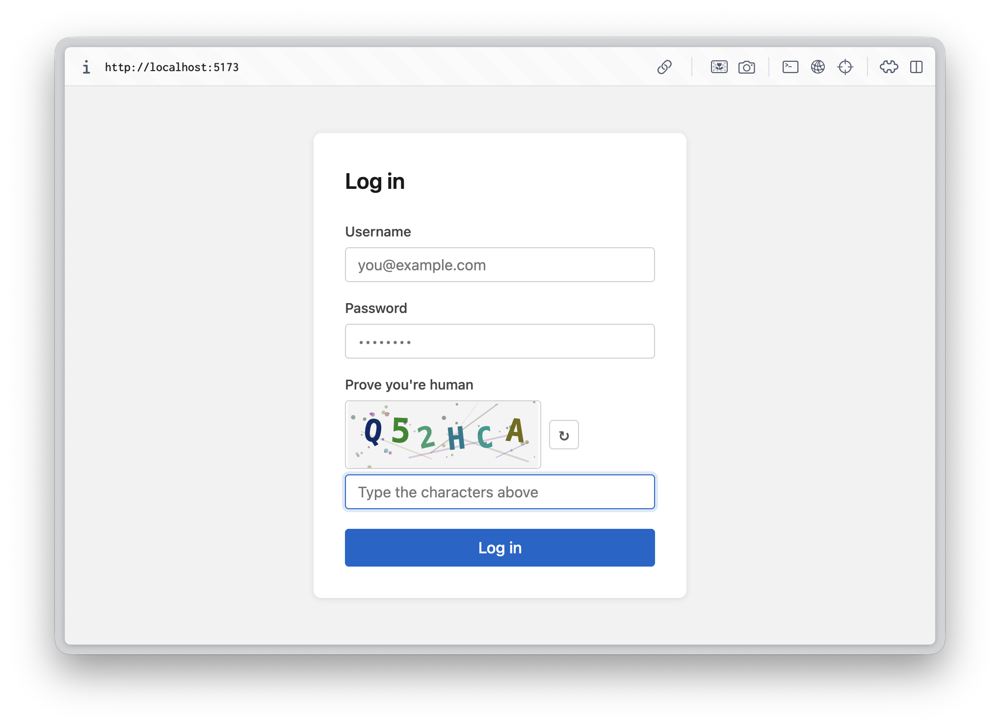

# Simple Captcha starter 



A minimal, well-structured CAPTCHA reference implementation built with
**Vite + TypeScript** (frontend) and **Express + TypeScript** (backend).

Designed as a starting point to build the
*worst CAPTCHA UX possible* — every meaningful behaviour is surfaced
through clearly documented extension points.

---

## Getting started

### Prerequisites

| Tool | Version | Check with |
| --- | --- | --- |
| [Node.js](https://nodejs.org/) | 18 or later (20+ recommended) | `node --version` |
| npm | Comes with Node.js | `npm --version` |
| A modern browser | Chrome, Firefox, Safari, Edge | — |

> No global packages are needed. Everything runs locally from `node_modules/`.

### Install & run

```bash
# 1. Clone the repo and step into it
git clone https://github.com/larsbaunwall/captcha-sample.git
cd captcha-sample

# 2. Install dependencies (one-time, ~10 seconds)
npm install

# 3. Start both the API and the UI with a single command
npm run dev
```

Open <http://localhost:5173> in your browser. You should see a login form
with a distorted CAPTCHA image. Type the characters, fill in any
username/password, and click **Log in**.

> The Express API runs on port **3001**; Vite proxies `/api/*` requests to it
> automatically, so you never have to touch CORS or ports during development.

### Verify the backend directly

If the page does not load a CAPTCHA, hit the API yourself:

```bash
curl http://localhost:3001/api/captcha/challenge
# → {"token":"…","imageData":"data:image/svg+xml;base64,…"}
```

A JSON response means the server is healthy and the issue is in the browser.

---

## Project structure

```text
captcha-sample/
├── index.html            # Login page (HTML)
├── vite.config.ts        # Vite dev server + /api proxy
├── tsconfig.json
│
├── src/
│   ├── main.ts           # Front-end logic (fetch challenge, submit form)
│   └── style.css         # Plain CSS — no framework
│
└── server/
    ├── config.ts         # ★ PRIMARY EXTENSION POINT — tweak everything here
    ├── captcha.ts        # Challenge generation (SVG renderer) + token store
    └── index.ts          # Express routes: GET /challenge, POST /verify
```

---

## How the CAPTCHA works

```text
Browser                          Express API
  │                                   │
  │── GET /api/captcha/challenge ─────▶│  generate random text
  │                                   │  render distorted SVG
  │                                   │  store { token → answer } in memory
  │◀── { token, imageData } ──────────│
  │                                   │
  │  (user fills in form + answer)    │
  │                                   │
  │── POST /api/captcha/verify ───────▶│  look up token
  │   { token, answer, user, pass }   │  compare answer (token consumed)
  │◀── { success, message } ──────────│  validate credentials
```

Tokens are **single-use**: a failed attempt always forces the user to
solve a new challenge.

---

## Extension points

### 1. `server/config.ts` — change difficulty and appearance

This is the first file to look at.  Every configurable value is annotated:

| Property | Effect |
| --- | --- |
| `length` | Number of characters in the challenge |
| `charset` | Pool of characters to sample from |
| `width` / `height` | Image dimensions |
| `fontSize` | Base size of each character |
| `noise.lines` | Noise lines drawn across the image |
| `noise.dots` | Noise dots scattered across the image |
| `expiryMs` | How long a challenge token stays valid |
| `caseSensitive` | Whether the answer check is case-sensitive |

**Example — make it nearly impossible:**

```ts
// server/config.ts
export const captchaConfig = {
  length: 8,
  charset: '0Oo1lI',          // maximally ambiguous characters
  noise: { lines: 20, dots: 200 },
  fontSize: 18,
  caseSensitive: true,
  // …
};
```

### 2. `server/captcha.ts` — swap the challenge type

Replace `renderSvg()` to change how challenges look.  The function receives
the plain-text answer and must return a valid SVG string.  The token store
and verify logic stay the same.

Ideas:

- **Math formula** — generate `3 × 4 + 1 = ?` and render it as SVG text
- **Emoji sequence** — pick random emoji, ask the user to type them in order
- **Audio CAPTCHA** — return a Base64 WAV file instead of an image
- **Drag-and-drop puzzle** — replace the `` on the front end with a canvas widget

### 3. `src/main.ts` — change the front-end interaction

The fetch/submit logic is deliberately simple.  You can:

- Replace the `` with a `<canvas>` element and render client-side
- Add animations, timers, fake "loading" spinners, or deliberately bad UX
- Show/hide the challenge in unexpected ways

### 4. `server/index.ts` — add real authentication

The credential check is a stub.  Swap it for any auth library
(Passport.js, jose, bcrypt + SQLite, etc.).

### 5. Accessibility — a deliberate teaching opportunity

CAPTCHAs are notorious for excluding users with visual or motor impairments.
The current `` widget has no audio fallback, no high-contrast mode, and
no keyboard-friendly alternative. **This is on purpose** — improving (or
deliberately worsening) accessibility is a great UX experiment.

---

## Testing

There is no automated test suite in this sample (kept minimal on purpose).
Use the following manual checklist when you change something:

| # | Step | Expected |
| --- | --- | --- |
| 1 | Load <http://localhost:5173> | A CAPTCHA image appears within ~1 s |
| 2 | Click the ↻ refresh button | A *different* image loads |
| 3 | Submit with **wrong** CAPTCHA + any credentials | Red error + new image |
| 4 | Submit with **correct** CAPTCHA + non-empty credentials | Green success message |
| 5 | Submit twice with the same token | Second attempt fails (single-use) |
| 6 | Wait 5+ minutes, then submit | Token expired error |

### Quick API smoke test

```bash
# Get a challenge
curl -s http://localhost:3001/api/captcha/challenge | jq

# Try to verify with a bogus answer (should return 422)
curl -s -X POST http://localhost:3001/api/captcha/verify \
  -H 'Content-Type: application/json' \
  -d '{"token":"bad","answer":"bad","username":"u","password":"p"}'
```

---

## Troubleshooting

| Symptom | Likely cause | Fix |
| --- | --- | --- |
| `EADDRINUSE: address already in use :::3001` | Another process holds port 3001 | `lsof -i :3001` then `kill <pid>`, or change `PORT` in `server/index.ts` |
| `EADDRINUSE` on port 5173 | Another Vite app is running | Stop it, or change `server.port` in `vite.config.ts` |
| Browser shows "Could not load CAPTCHA" | API not running, or proxy misconfigured | Confirm both `[api]` and `[ui]` lines appear in the `npm run dev` output |
| `Cannot find module 'express'` | Dependencies not installed | Run `npm install` |
| TypeScript red squiggles in the editor | Editor using a different TS version | Use VS Code's *Use Workspace Version* command |
| `node: bad option: --watch` | Node.js version too old | Upgrade to Node 18+ |

---

## Available scripts

| Command | Description |
| --- | --- |
| `npm run dev` | Start Vite + Express in watch mode (recommended) |
| `npm run build` | Build the frontend to `dist/` |
| `npm run preview` | Preview the production build |

---

## Tech stack

| Layer | Technology |
| --- | --- |
| Frontend bundler | [Vite](https://vitejs.dev/) |
| Frontend language | TypeScript |
| Backend framework | [Express](https://expressjs.com/) |
| Backend runner | [tsx](https://github.com/privatenumber/tsx) (no compile step needed) |
| CAPTCHA image | Inline SVG — no native dependencies |

---

## License

MIT — see [LICENSE](LICENSE). Free to fork, modify, and submit your worst (or
best) CAPTCHA experiment to the competition.
